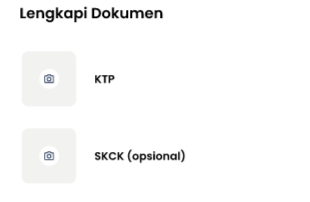

# **Api Endpoint**

Setiap Request Endpoint Wingman, User, Product, Chating, dll Membutuhkan Headers `sessid`. Headers Tersebut Didapat Dari :

```js
/* WITH NODE-FETCH */

const fetch = require('node-fetch');

const sessid = await fetch(`${domain}/api/v1/auth/get-token`, {
    headers: {
        auth: 'ini rahasia' // authnya memang seperti ini "ini rahasia"
    }
})
console.log(data.headers.get('sessid')) // jPBI7pczvwGVgpJT6rlj9AOU2pHn81

/* WITH AXIOS */

const { default: Axios } = require('axios');

const sessid = await Axios.get(`${domain}/api/v1/auth/get-token`, {
    headers: {
        auth: 'ini rahasia'
    }
})
console.log(data.headers.sessid)
```

# Endpoint WINGMAN

**1. Pendaftaran (Input No HP)**

Mengirimkan OTP Ke Nomer WhatsApp Target


**METHOD : POST**

*body > hp*

*headers > sessid: xxx*

*Endpoint > /api/v1/wingman/send-otp-wingman*

```js
/* EXAMPLE WITH NODE-FETCH */

const fetch = require('node-fetch');

const send = await fetch(`${domain}/api/v1/wingman/send-otp-wingman`, {
    method: 'POST',
    credentials: 'include',
    body: JSON.stringify({
        "hp": "6287715579966",
    }),
    headers: {
        'Accept': "application/json",
        'Content-Type': 'application/json',
        'sessid': data.headers.get('sessid'),
    },
})
```

**2. Input OTP**

Login Wingman Dengan Menggunakan OTP, Jika Wingman Belum terdaftar Otomatis akan Dibuat Data `null` pada Beberapa Field DB. Untuk Mengisinya/Push DB Gunakan Endpoint `/register-wingman`


**METHOD : POST**

*body > username, password*

*headers > sessid: xxx*

*Endpoint > /api/v1/wingman/login-wingman*

```js
/* EXAMPLE WITH NODE-FETCH */

const fetch = require('node-fetch');

const login = await fetch(`${domain}/api/v1/wingman/login-wingman`, {
    method: 'POST',
    credentials: 'include',
    body: JSON.stringify({
        "username": "6287715579966",
        "password": "115914"
    }),
    headers: {
        'Accept': "application/json",
        'Content-Type': 'application/json',
        'sessid': data.headers.get('sessid'),
    },
})
```

**3. SUBMIT DATA WINGMAN**

Data Submit Wingman Sementara Disimpan Didalam JSON, Gunakan Endpoint `/register-wingman` Untuk Push JSON ke MongoDB (Pastikan Sudah Login)


**METHOD : POST**

*body > nama, email, alamat, kota, pasar, bank, no_rek, nama_rek*

*headers > sessid: xxx, client-type: wingman*

*Endpoint > /api/v1/wingman/submit-data*

`NB: Upload KTP/SKCK Menggunakan Endpoint /api/v1/upload`

**4. PREVIEW DATA WINGMAN SEBELUM PUSH DB**

Preview Data JSON Sebelum Di PUSH KE MongoDB


**METHOD : GET**

*headers > sessid: xxx, client-type: wingman*

*Endpoint > /api/v1/wingman/preview-wingman*

**5. REGISTRASI PUSH DB WINGMAN**

Memperbarui Data `null` Saat Login Dan Mengganti Dengan Apa Yang sudah d Submit (Pastikan Sudah Submit)

`NO IMG`

**METHOD : GET**

*headers > sessid: xxx, client-type: wingman*

*Endpoint > /api/v1/wingman/register-wingman*

**6. GET/CHECK DATA WINGMAN**

Melihat Data Wingman Yang Tersimpan di MongoDB (Pastikan Sudah Login)


**METHOD : GET**

*headers > sessid: xxx, client-type: wingman*

*Endpoint > /api/v1/wingman/wingman-data*

```js
/* EXAMPLE WITH NODE-FETCH */

const fetch = require('node-fetch');

const get = await fetch(`${domain}/api/v1/wingman/wingman-data`, {
    credentials: "include",
    headers: {
        "client-type": "wingman",
        sessid: data.headers.get('sessid'),
        cookie: "Cookie Login jwt"
    },
})

return get.json()
```
**7. MENGGANTI DATA WINGMAN**

Endpoint ini Hanya Mengganti Apa Yang Sudah di Submit Wingman (Pastikan Sudah Login)

`NO IMG`

**METHOD : POST**

*body > nama, email, alamat, kota, pasar, bank, no_rek, nama_rek* 

*headers > sessid: xxx, client-type: wingman*

*Endpoint > /api/v1/wingman/change-data-wingman*

`NB: Body Tidak Harus Diisi Semua, Bisa Salah Satu Saja Yang Ingin Di Perbarui`

**8. MENGGANTI STATUS LAYANAN**

Mengubah Status Layanan/Available (Pastikan Sudah Login)

`Image NO. 6`

**METHOD : GET**

*query > ?status_available=(true/false)*

*headers > sessid: xxx, client-type: wingman*

*Endpoint > /api/v1/wingman/switch-available*

**9. MENGGANTI JUMLAH ORDERAN**

Mengubah Jumlah Orderan Wingman, Today Order & Total Order (Pastikan Sudah Login)

`Image NO. 6`

**METHOD : POST**

*params > :action (add/reset)*

*body > added: 3* (Bisa Mines, example > added: -5)

*headers > sessid: xxx, client-type: wingman*

*Endpoint Today > /api/v1/wingman/edit-today-order/:action*

*Endpoint Total > /api/v1/wingman/edit-total-order/:action*

**10. MENGGANTI JUMLAH PENDAPATAN**

Mengubah Jumlah Pendapatan Wingman (Pastikan Sudah Login)

`Image NO. 6`

**METHOD : POST**

*params > :action (add/reset)*

*body > added: 3* (Bisa Mines, example > added: -5)

*headers > sessid: xxx, client-type: wingman*

*Endpoint > /api/v1/wingman/edit-income/:action*

**11. DELETE NULL WINGMAN**

Menghapus Document Wingman Dengan Status `null`/Belum Push MongoDB + Menghapus Data JSONnya Jika Pernah Submit Data dan Belum Push MongoDB

`NO IMG`

**METHOD : POST**

*body > no_hp: 62xx*

*headers > sessid: xxx*

*Endpoint > /api/v1/wingman/delete-submit*

**12. DELETE WINGMAN**

Menghapus Document Wingman Dengan Status **tidak** `null`/Sudah Push MongoDB

`NO IMG`

**METHOD : POST**

*body > no_hp: 62xx*

*headers > sessid: xxx*

*Endpoint > /api/v1/wingman/delete-wingman*

**13. DELETE ALL WINGMAN**

Menghapus Semua Document Wingman di MongoDB

`NO IMG`

**METHOD : GET**

*headers > sessid: xxx*

*Endpoint > /api/v1/wingman/delete-all-wingman*

**14. LOGOUT WINGMAN**

Logout Wingman

`NO IMG`

**METHOD : GET**

*headers > sessid: xxx, client-type: wingman*

*Endpoint > /api/v1/wingman/logout-wingman*

**15. CHECK STATUS WINGMAN**

Untuk Check, Apakah Sudah Login, `null` data (Belum Registrasi), dan **Bukan** `null` data (Sudah Registrasi/Push MongoDB)

`NO IMG`

**METHOD : GET**

*Endpoint > /api/v1/wingman/*

# Endpoint USER

**1. SEND OTP USER**

Mengirimkan OTP Ke Nomer WhatsApp Target User

`NO IMG`

**METHOD : POST**

*body > hp*

*headers > sessid: xxx*

*Endpoint > /api/v1/user/send-otp-user*

**2. LOGIN OTP USER**

Login User Menggunakan OTP, Jika Belum Terdaftar Otomatis Dibuatkan Field data `null`

`NO IMG`

**METHOD : POST**

*body > username, password*

*headers > sessid: xxx*

*Endpoint > /api/v1/user/login-user*

**3. REGISTER USER**

Memperbarui Data `null` Saat Login Dan Mengganti Dengan Apa Yang sudah di Submit di body

`NO IMG`

**METHOD : POST**

*body > nama, alamat, email*

*headers > sessid: xxx, client-type: user*

*Endpoint > /api/v1/user/register-user*

**4. CHECK DATA USER**

Check Data User di MongoDB

`NO IMG`

**METHOD : GET**

*headers > sessid: xxx, client-type: user*

*Endpoint > /api/v1/user/user-data*

```js
/* EXAMPLE WITH NODE-FETCH */

const fetch = require('node-fetch');

const get = await fetch(`${domain}/api/v1/user/user-data`, {
    credentials: "include",
    headers: {
        "client-type": "user",
        sessid: data.headers.get('sessid'),
        cookie: "Cookie Login jwt"
    },
})

return get.json()
```

**5. MENGGANTI DATA USER**

Endpoint ini Hanya Mengganti Apa Yang Ada di body (Pastikan Sudah Login)

`NO IMG`

**METHOD : POST**

*body > nama, alamat, email* 

*headers > sessid: xxx, client-type: user*

*Endpoint > /api/v1/user/change-data-user*

`NB: Body Tidak Harus Diisi Semua, Bisa Salah Satu Saja Yang Ingin Di Perbarui`

**6. LOGOUT USER**

Logout User

`NO IMG`

**METHOD : GET**

*headers > sessid: xxx, client-type: user*

*Endpoint > /api/v1/user/logout-user*

**7. DELETE USER**

Menghapus Document User Yang Null dan Sudah Register User

`NO IMG`

**METHOD : POST**

*body > no_hp: 62xx*

*headers > sessid: xxx*

*Endpoint > /api/v1/user/delete-user*

**8. DELETE ALL USER**

Menghapus Semua Document User Yang Tersimpan

`NO IMG`

**METHOD : POST**

*headers > sessid: xxx*

*Endpoint > /api/v1/user/delete-all-user*

# Endpoint UPLOAD FILE

Upload File Menggunakan Multer, Semua File Tersimpan Didalam Folder public/file

**1. UPLOAD KTP WINGMAN**

Upload KTP Wingman ke Folder Public dan return Data HEX, ubah ke base64 jika Ingin d Tampilkan



**METHOD : POST**

*headers > sessid: xxx, client-type: wingman*

*Endpoint > /api/v1/upload/wingman/ktp*

```js
/* EXAMPLE WITH AXIOS */

const FormData = require('form-data');
const { default: Axios } = require('axios');
const fs = require('fs-extra');

const fd = new FormData()
fd.append('file', fs.createReadStream(PATH_IMAGE))
Axios({
        method: 'POST',
        withCredentials: true,
        url: 'http://localhost:5050/api/v1/upload/wingman/ktp',
        data: fd,
        headers: {  
            'content-type': `multipart/form-data; boundary=${fd._boundary}`,
            'client-type': 'wingman',
            cookie: "Cookie Login jwt", 
            'sessid': data.headers.get('sessid'),
        },
}).then(({ data }) => {
    console.log(data)
}).catch(reject)
```


**2. UPLOAD SKCK WINGMAN**

Upload SKCK Wingman ke Folder Public dan return Data HEX, ubah ke base64 jika Ingin d Tampilkan


**METHOD : POST**

*headers > sessid: xxx, client-type: wingman*

*Endpoint > /api/v1/upload/wingman/skck*

**3. UPLOAD PROFILE IMAGE WINGMAN**

Upload Image Wingman ke Folder Public dan return Data HEX, ubah ke base64 jika Ingin d Tampilkan

`NO IMG`

**METHOD : POST**

*headers > sessid: xxx, client-type: wingman*

*Endpoint > /api/v1/upload/wingman/profile*

**4. UPLOAD PROFILE IMAGE USER**

Upload Image User ke Folder Public dan return Data HEX, ubah ke base64 jika Ingin d Tampilkan

`NO IMG`

**METHOD : POST**

*headers > sessid: xxx, client-type: user*

*Endpoint > /api/v1/upload/user/profile*

# Endpoint CHATING

**1. CREATE ROOM UNTUK 2 ORANG**

Membuat Room Chat untuk 2 Orang


**METHOD : GET**

*params > :user, :target* (Di Isi Masing-Masing Id)

*headers > sessid: xxx*

*Endpoint > /api/v1/chat/create/:user/:target*

**2. SEND MESSAGE KE ROOM**

Mengirimkan Pesan Ke Sebuah Room Chat


**METHOD : POST**

*params > :room, :user* (Di Isi Masing-Masing Id)

*body > message*

*headers > sessid: xxx*

*Endpoint > /api/v1/chat/msg/:room/:user*

```js
/* EXAMPLE WITH NODE-FETCH */

const fetch = require('node-fetch');

const get = await fetch(`${domain}/api/v1/chat/msg/${room_id}/${user_id/wingman_id}`, {
    method: "POST",
    credentials: "include",
    body: JSON.stringify({
        "message": "ok thank you gann",
    }),
    headers: {
        'Accept': "application/json",
        'Content-Type': 'application/json',
        sessid: data.headers.get('sessid'),
    },
})

return get.json()
```

**3. GET ALL MESSAGE ROOM**

Menlihat Semua Pesan Yang ada Di Dalam Sebuah Room Chat

`NO IMG`

**METHOD : GET**

*params > :room* (Di Isi Masing-Masing Id)

*headers > sessid: xxx*

*Endpoint > /api/v1/chat/get-msg-room/:room*

**4. DELETE MESSAGE**

Menghapus Sebuah Pesan Dari id message

`NO IMG`

**METHOD : GET**

*params > :idmsg* (Di Isi Masing-Masing Id)

*headers > sessid: xxx*

*Endpoint > /api/v1/chat/delete-msg/:idmsg*

**5. MESSAGE TELAH TERBACA**

Menandai Bahwa Pesan Telah Terbaca

`NO IMG`

**METHOD : GET**

*params > :idmsg* (Di Isi Masing-Masing Id)

*headers > sessid: xxx*

*Endpoint > /api/v1/chat/read-msg/:idmsg*

**6. SEND MESSAGE WITH FILE**

Mengirim pesan dengan File, upload terlebih dahulu

`NO IMG`

**METHOD : POST**

*params > :room, :user* (Di Isi Masing-Masing Id)

*body > text*

*headers > sessid: xxx*

*Endpoint > /api/v1/upload/chat/file/:room/:user*

# Endpoint PRODUCT

**1. CREATE PRODUCT**

Membuat Product Baru dan Disimpan di dalam MongoDB

`NO IMG`

**METHOD : POST**

*body > product_name, product_category, product_grade, product_image, product_price, product_uom*

*headers > sessid: xxx*

*Endpoint > /api/v1/product/create-product*

**2. UPDATE SUATU PRODUCT**

Mengupdate Suatu Product dari Id Product

`NO IMG`

**METHOD : POST**

*params > :ids*

*body > product_name, product_category, product_grade, product_image, product_price, product_uom*

*headers > sessid: xxx*

*Endpoint > /api/v1/product/update-product/:ids*

`NB: Body Tidak Harus Diisi Semua, Bisa Salah Satu Saja Yang Ingin Di Perbarui`

**3. MELIHAT SATU PRODUCT**

Read 1 Product di MongoDB dari id nya


**METHOD : GET**

*params > :ids*

*headers > sessid: xxx*

*Endpoint > /api/v1/product/read-one-product/:ids*

**4. MELIHAT SEMUA PRODUCT**

Read ALL Product di MongoDB


**METHOD : GET**

*headers > sessid: xxx*

*Endpoint > /api/v1/product/read-all-product*

**5. MENGHAPUS SATU PRODUCT**

Delete Satu Product di MongoDB dari id nya

`NO IMG`

**METHOD : GET**

*params > :ids*

*headers > sessid: xxx*

*Endpoint > /api/v1/product/delete-one-product/:ids*

**6. MENGHAPUS SEMUA PRODUCT**

Delete ALL Product di MongoDB

`NO IMG`

**METHOD : GET**

*params > :ids*

*headers > sessid: xxx*

*Endpoint > /api/v1/product/delete-all-product*
