# ENDPOINT TRANSACTION

#### ***Base URL : http://iagora.id***

## STATUS TRANSAKSI
- **1 ➭** Menunggu Accept Order Dari Wingman
- **2 ➭** Order Telah di Accept Oleh Wingman
- **3 ➭** Telah Selesai Menawar, Belum Bayar Menunggu User Upload Bukti Pembayaran
- **4 ➭** Bukti Pembayaran Telah di Upload User
- **5 ➭** Order Telah di Bayar Oleh User (Mengubah Status 5 Dari Sisi Admin)
- **6 ➭** Order Di Proses Oleh Wingman
- **7 ➭** Orderan Sedang Dikirim Oleh Wingman
- **8 ➭** Wingman Telah Mengupload Bukti Bahwa Product Telah Sampai Ke User

## IN USER
### 1. ADD TO CART

Menambahkan Product ke Keranjang User

**`URL : ${BaseURL}/api/v1/transaction/user/add-cart`**
<center>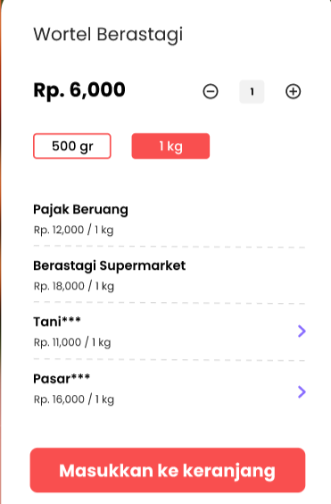</center>

**METHOD : POST**

***BODY (id_product, quantity, price_awal) :***

```js
{
    "id_product": "61e262aae6b1e7d71e271635",
    "quantity": "2",
    "price_awal": "6000"
}
```

***HEADERS (sessid, cookie, client-type) :***

```js
headers: {
    "sessid": "abcdefghi",
    "cookie": "jwt=abcdef", 
    "client-type": "user"
}
```

### 2. CART

Melihat Produk yang Ada didalam Keranjang User

**`URL : ${BaseURL}/api/v1/transaction/user/in-cart`**

<center>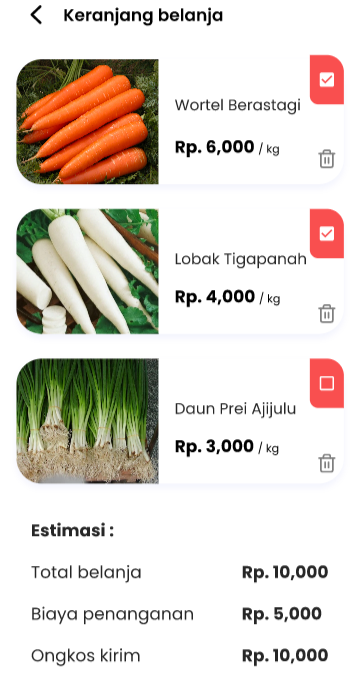</center>

**METHOD : GET**

***HEADERS (sessid, cookie, client-type) :***

```js
headers: {
    "sessid": "abcdefghi",
    "cookie": "jwt=abcdef", 
    "client-type": "user"
}
```

### 3. Mark Product In CART

Menandai Produk yang Ada didalam Keranjang User

**`URL : ${BaseURL}/api/v1/transaction/user/mark-cart`**

**`IMG NO 2`**

**METHOD : GET**

***PARAMS (id product, status: Boolean) :***

`${BaseURL}/api/v1/transaction/user/mark-cart/61e262ace6b1e7d71e271637/false`

***HEADERS (sessid, cookie, client-type) :***

```js
headers: {
    "sessid": "abcdefghi",
    "cookie": "jwt=abcdef", 
    "client-type": "user"
}
```

### 4. Delete Product In CART

Menghapus Produk yang Ada didalam Keranjang User

**`URL : ${BaseURL}/api/v1/transaction/user/delete-cart`**

**`IMG NO 2`**

**METHOD : GET**

***PARAMS (id product) :***

`${BaseURL}/api/v1/transaction/user/delete-cart/61e262aae6b1e7d71e271635`

***HEADERS (sessid, cookie, client-type) :***

```js
headers: {
    "sessid": "abcdefghi",
    "cookie": "jwt=abcdef", 
    "client-type": "user"
}
```

### 5. Edit Product In CART

Mengedit Quantity Product di Keranjang User

**`URL : ${BaseURL}/api/v1/transaction/user/add-cart`**

**`NO IMG`**

**METHOD : POST**

***BODY (id_product, quantity) :***

```js
{
    "id_product": "61e262aae6b1e7d71e271635",
    "quantity": "6"
}
```

***HEADERS (sessid, cookie, client-type) :***

```js
headers: {
    "sessid": "abcdefghi",
    "cookie": "jwt=abcdef", 
    "client-type": "user"
}
```

### 6. Book/Find Wingman

Mencari Wingman Yang ada Di sekitar Pasar (Pencarian Berdasarkan Kota dan Pasar Hasil Register Wingman Diawal). Wingman Yang Mendapatkan Orderan Dari User adalah Wingman Yang Tidak Memiliki Orderan/Orderan Saat ini < 2 

Transaksi Dibuat Dan akan Disimpan di DB User dan Wingman **(STATUS ORDER = 1)**

**`URL : ${BaseURL}/api/v1/transaction/user/find-wingman`**

<center>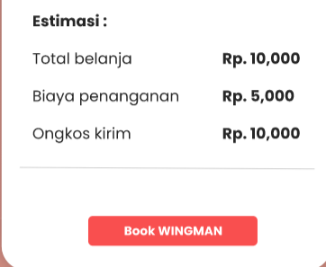</center>

**METHOD : GET**

***PARAMS (pasar, kota) :***

`${BaseURL}/api/v1/transaction/user/find-wingman/rawa-indah/balikpapan`

***HEADERS (sessid, cookie, client-type) :***

```js
headers: {
    "sessid": "abcdefghi",
    "cookie": "jwt=abcdef", 
    "client-type": "user"
}
```

### 6. Cancel Order By User

Membatalkan Orderan

**`URL : ${BaseURL}/api/v1/transaction/user/cancel-order`**

<center>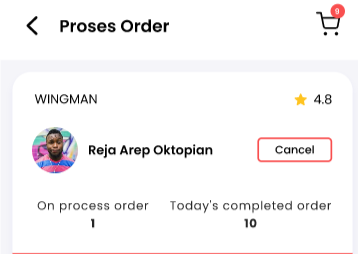</center>

**METHOD : GET**

***PARAMS (id order) :***

`${BaseURL}/api/v1/transaction/user/cancel-order/k3bWpIx0jDJb2zMv36z4v5kM`

***HEADERS (sessid, cookie, client-type) :***

```js
headers: {
    "sessid": "abcdefghi",
    "cookie": "jwt=abcdef", 
    "client-type": "user"
}
```

### 7. All Transaction User

Melihat Status Transaksi Tertentu. List **STATUS TRANSAKSI** Ada Diatas

**`URL : ${BaseURL}/api/v1/transaction/user/in-transaction`**

<center>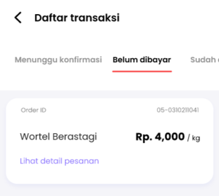</center>

**METHOD : POST**

***BODY (status: Array) :***

```js
{
    "status": [
        "3"
    ]
}
```

***HEADERS (sessid, cookie, client-type) :***

```js
headers: {
    "sessid": "abcdefghi",
    "cookie": "jwt=abcdef", 
    "client-type": "user"
}
```

### 8. Detail Orderan

Melihat Detail Transaksi.

**`URL : ${BaseURL}/api/v1/transaction/user/transaction-detail`**

<center>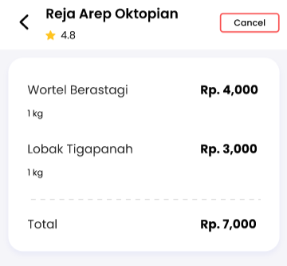</center>

**METHOD : GET**

***PARAMS (id order) :***

`${BaseURL}/api/v1/transaction/user/transaction-detail/k3bWpIx0jDJb2zMv36z4v5kM`

***HEADERS (sessid, cookie, client-type) :***

```js
headers: {
    "sessid": "abcdefghi",
    "cookie": "jwt=abcdef", 
    "client-type": "user"
}
```

### 16. Upload Bukti Pembayaran

Mengupload Bukti Pembayaran Dari User dan Merubah **Status Transaksi Menjadi 4**

**`URL : ${BaseURL}/api/v1/upload/user/transaction`**

**`NO IMG`**

**METHOD : POST**

***BODY (file) :***

`file : multipart/form-data`

***PARAMS (id order) :***

`${BaseURL}/api/v1/upload/user/transaction/k3bWpIx0jDJb2zMv36z4v5kM`

***HEADERS (sessid, cookie, client-type) :***

```js
headers: {
    "sessid": "abcdefghi",
    "cookie": "jwt=abcdef", 
    "client-type": "user"
}
```

### 21. Input Saran Dari User

Menginput Saran Untuk Wingman

**`URL : ${BaseURL}/api/v1/transaction/user/input-saran`**

<center>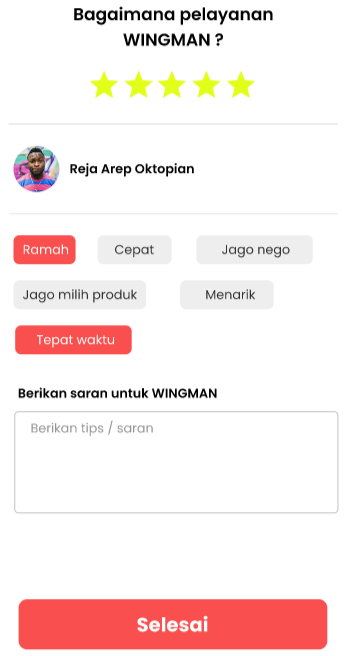</center>

**METHOD : POST**

***PARAMS (id order) :***

`${BaseURL}/api/v1/transaction/user/input-saran/k3bWpIx0jDJb2zMv36z4v5kM`

***BODY (status: Array) :***

```js
{
   "stars": 5,
    "box": [
        "ramah","tepat waktu"
    ]
}
```

***HEADERS (sessid, cookie, client-type) :***

```js
headers: {
    "sessid": "abcdefghi",
    "cookie": "jwt=abcdef", 
    "client-type": "user"
}
```

---

## IN WINGMAN

### 9. Accept Oerder

Menerima Orderan Dari User Dan **Merubah Status Order Menjadi 2**

**`URL : ${BaseURL}/api/v1/transaction/wingman/accept-order`**

<center>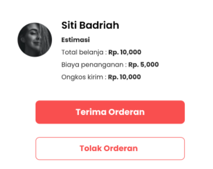</center>

**METHOD : GET**

***QUERY (status: Boolean, id_order) :***

`${BaseURL}/api/v1/transaction/wingman/accept-order/?status=true&id_order=1MwQpcsoVLEKvbKq3VzMSVpa`

***HEADERS (sessid, cookie, client-type) :***

```js
headers: {
    "sessid": "abcdefghi",
    "cookie": "jwt=abcdef", 
    "client-type": "wingman"
}
```

### 10. All Transaction Wingman

Melihat Status Transaksi Tertentu. List **STATUS TRANSAKSI** Ada Diatas

**`URL : ${BaseURL}/api/v1/transaction/wingman/in-process`**

<center>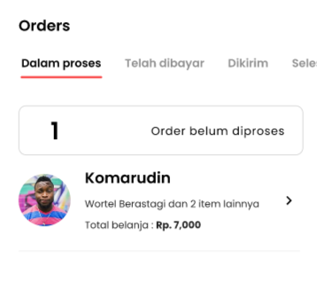</center>

**METHOD : POST**

***BODY (status: Array) :***

```js
{
    "status": [
        "3"
    ]
}
```

***HEADERS (sessid, cookie, client-type) :***

```js
headers: {
    "sessid": "abcdefghi",
    "cookie": "jwt=abcdef", 
    "client-type": "wingman"
}
```

### 11. Detail Orderan

Melihat Detail Transaksi.

**`URL : ${BaseURL}/api/v1/transaction/wingman/process-order`**

<center>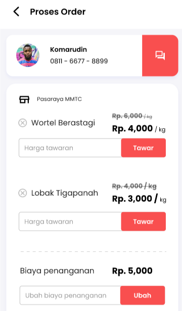</center>

**METHOD : GET**

***PARAMS (id order) :***

`${BaseURL}/api/v1/transaction/wingman/process-order/k3bWpIx0jDJb2zMv36z4v5kM`

***HEADERS (sessid, cookie, client-type) :***

```js
headers: {
    "sessid": "abcdefghi",
    "cookie": "jwt=abcdef", 
    "client-type": "wingman"
}
```

### 12. Menambah Produk Di Wingman

Menambah Produk Pada Wingman / Pada Proses Order

**`URL : ${BaseURL}/api/v1/transaction/wingman/add-tawar`**

**`NO IMG`**

**METHOD : POST**

***BODY (id_product, id_order, quantity, price_awal) :***

```js
{
    "id_product": "61e262ace6b1e7d71e271637", 
    "id_order": "k3bWpIx0jDJb2zMv36z4v5kM", 
    "quantity": "5", 
    "price_awal": "7000"
}
```

***HEADERS (sessid, cookie, client-type) :***

```js
headers: {
    "sessid": "abcdefghi",
    "cookie": "jwt=abcdef", 
    "client-type": "wingman"
}
```

### 13. Edit Quantity Produk Di Wingman

Edit Quantity Produk Pada Wingman / Pada Proses Order

**`URL : ${BaseURL}/api/v1/transaction/wingman/edit-tawar`**

**`NO IMG`**

**METHOD : POST**

***BODY (id_product, id_order, quantity) :***

```js
{
    "id_product": "61e262ace6b1e7d71e271637", 
    "id_order": "k3bWpIx0jDJb2zMv36z4v5kM",  
    "quantity": "10"
}
```

***HEADERS (sessid, cookie, client-type) :***

```js
headers: {
    "sessid": "abcdefghi",
    "cookie": "jwt=abcdef", 
    "client-type": "wingman"
}
```

### 14. Delete Produk Di Wingman

Menghapus Produk Pada Wingman / Pada Proses Order

**`URL : ${BaseURL}/api/v1/transaction/wingman/delete-tawar`**

**`NO IMG`**

**METHOD : GET**

***PARAMS (id order, id product) :***

`${BaseURL}/api/v1/transaction/wingman/delete-tawar/k3bWpIx0jDJb2zMv36z4v5kM/61e262ace6b1e7d71e271637`

***HEADERS (sessid, cookie, client-type) :***

```js
headers: {
    "sessid": "abcdefghi",
    "cookie": "jwt=abcdef", 
    "client-type": "wingman"
}
```

### 15. Proses / Input Menawar Order

Setelah Selesai Menambahkan/Edit/Delete Produk Dari Sisi Wingman Selanjutnya Adalah Di proses Serta **Merubah Status Menjadi 3**

( Untuk Membatalkan Orderan Cukup Akses Endpoint **Accept Order** Dengan Query Status = false )

**`URL : ${BaseURL}/api/v1/transaction/wingman/tawar-order`**

<center>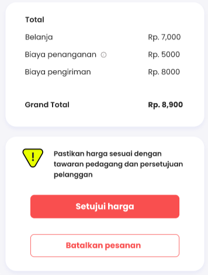</center>

**METHOD : POST**

***PARAMS (id order) :***

`${BaseURL}/api/v1/transaction/wingman/tawar-order/k3bWpIx0jDJb2zMv36z4v5kM`

***BODY (id_product, id_order, quantity) :***

```js
{
    "harga_produk": [
        5000 // Banyak Array Sesuai Produk Yang ada Di Keranjang
    ],
    "penanganan": 3000,
    "ongkir": 7000
}
```

***HEADERS (sessid, cookie, client-type) :***

```js
headers: {
    "sessid": "abcdefghi",
    "cookie": "jwt=abcdef", 
    "client-type": "wingman"
}
```

### 19. Merubah Status Order Oleh Wingman

Wingman / Endpoint Ini Hanya Bisa Merubah **Status ke 6 dan 7**

**`URL : ${BaseURL}/api/v1/transaction/wingman/change-status`**

**`NO IMG`**

**METHOD : GET**

***PARAMS (id order) & QUERY (status: Number) :***

`${BaseURL}/api/v1/transaction/wingman/change-status/k3bWpIx0jDJb2zMv36z4v5kM/?status=6`

***HEADERS (sessid, cookie, client-type) :***

```js
headers: {
    "sessid": "abcdefghi",
    "cookie": "jwt=abcdef", 
    "client-type": "wingman"
}
```

### 20. Upload Bukti Order Selesai

Mengupload Bukti Bahwa Order Telah Sampai Dari Wingman dan Merubah **Status Transaksi Menjadi 8**

**`URL : ${BaseURL}/api/v1/upload/wingman/order-completed`**

<center>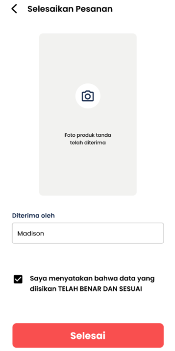</center>

**METHOD : POST**

***BODY (file) :***

`file : multipart/form-data`

***PARAMS (id order) :***

`${BaseURL}/api/v1/upload/wingman/order-completed/k3bWpIx0jDJb2zMv36z4v5kM`

***HEADERS (sessid, cookie, client-type) :***

```js
headers: {
    "sessid": "abcdefghi",
    "cookie": "jwt=abcdef", 
    "client-type": "wingman"
}
```

---

# IN ADMIN 

### 17. Check All Status Order Wingman

Check Semua Status Tertentu Orderan

**`URL : ${BaseURL}/api/v1/admin/belum-dibayar`**

**`NO IMG`**

**METHOD : POST**

***BODY (status: Array) :***

```js
{
    "status": [
        "4"
    ]
}
```

***HEADERS (sessid, cookie, client-type) :***

```js
headers: {
    "sessid": "abcdefghi",
    "cookie": "jwt=abcdef", 
    "client-type": "admin",
    "auths": "iagoraid"
}
```

### 18. Mengganti Status Orderan Dari Sisi Admin

Merubah **Status Transaksi Menjadi 5** Atau Sudah Bayar

**`URL : ${BaseURL}/api/v1/admin/status-bayar`**

**`NO IMG`**

**METHOD : GET**

***PARAMS (id order) :***

`${BaseURL}/api/v1/admin/status-bayar/k3bWpIx0jDJb2zMv36z4v5kM`

***HEADERS (sessid, cookie, client-type) :***

```js
headers: {
    "sessid": "abcdefghi",
    "cookie": "jwt=abcdef", 
    "client-type": "wingman"
}
```

### N/A. Menghapus Orderan Dari Sisi Admin

Menghapus Salah Satu Orderan Di DB User/Wingman (Bukan Menghapus Orderan Dari Keduanya)

**`URL : ${BaseURL}/api/v1/admin/delete-order`**

**`NO IMG`**

**METHOD : GET**

***PARAMS (id order, id wingman/user, type: user/wingman) :***

`${BaseURL}/api/v1/admin/delete-order/k3bWpIx0jDJb2zMv36z4v5kM/61f7eeb1dc89638055eafef8/wingman`

***HEADERS (sessid, cookie, client-type) :***

```js
headers: {
    "sessid": "abcdefghi",
    "cookie": "jwt=abcdef", 
    "client-type": "wingman"
}